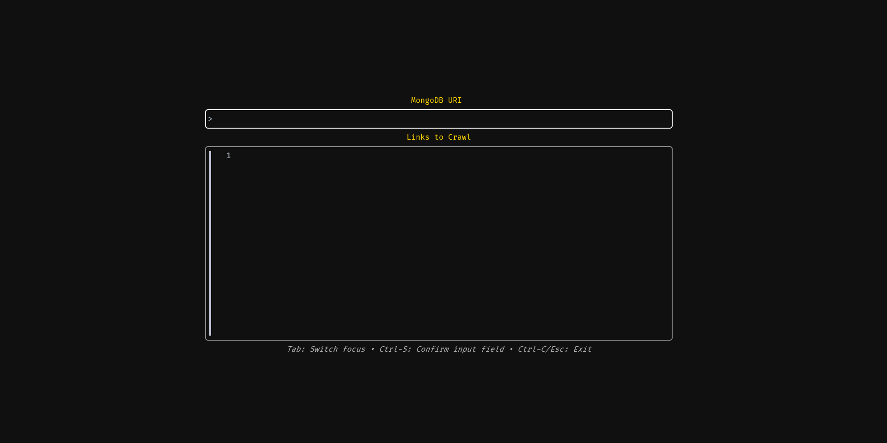
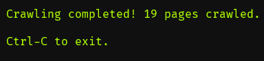
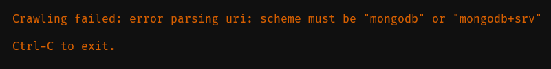

# crawler
This is a web crawler I wrote that allows for large scale concurrency while being stack safe and polite.

## Requirements
- [Go](https://go.dev/doc/install) installed
- A [MongoDB](https://www.mongodb.com/docs/atlas/getting-started/) cluster

## Installation
Run the following in your terminal:
```
go install github.com/junwei890/crawler@latest
```

Now run:
```
crawler
```

This gives you access to the UI in any working directory.

## Usage


This is the main UI, in the first input field, enter your MongoDB URI. In the second input field, enter any sites you would like to scrape.

Make sure each site is on a newline and has its protocol.

A successful crawl will show a message like the one below:



While an unsuccessful crawl will show a message like the one below:



## Notes
Some sites enforce allowed and disallowed routes as well as crawl delays, this crawler abides by all of them.

Feel free to fork the repo to make changes that fit your personal needs.

Contributions are welcomed.
